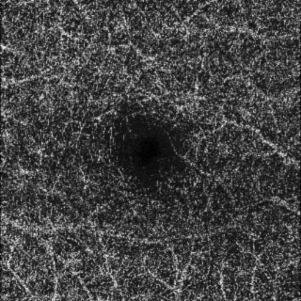

<h2>Tensorflow-Image-Segmentation-Augmented-Alzheimer-s-Disease (2024/09/24)</h2>

This is the second experiment of Image Segmentation for Alzheimer-s-Disease
 based on
the <a href="https://github.com/sarah-antillia/Tensorflow-Image-Segmentation-API">Tensorflow-Image-Segmentation-API</a>, and
the <a href="https://github.com/sarah-antillia/Tensorflow-Image-Segmentation-API">Tensorflow-Image-Segmentation-API</a>, and
<a href="https://drive.google.com/file/d/1yOgBhScahk4yb-xCleNFUfEG3JkXSgwi/view?usp=sharing">
FAZ_Alzheimer-s-Disease-ImageMask-Dataset-V1.zip
</a>
, which was derived by us from 
<a href="https://zenodo.org/records/5075563">
<b>OCTA image dataset with pixel-level mask annotation for FAZ segmentation</b>
</a>
  
On detail of FAZ_Alzheimer-s-Disease-ImageMask-Dataset, please refer to 
<a href="https://github.com/sarah-antillia/ImageMask-Dataset-FAZ_Alzheimer-s-Disease">ImageMask-Dataset-FAZ_Alzheimer-s-Disease</a>
 
 
<b>Data Augmentation Strategy:</b> 
 To address the limited size of the Alzheimer-s-Disease dataset, 
 we employed <a href="./src/ImageMaskAugmentor.py">an online augmentation tool</a> to enhance segmentation accuracy, which supports the following aumentation methods.
<li>verticalflip</li>
<li>horizontalflip</li>
<li>rotation</li>
<li>shrinks</li>
<li>shears</li> 
<li>deformation</li>
<li>distortion</li>
<li>barreldistortion</li>
<li>pincushiondistortion</li>

 

<b>Actual Image Segmentation for Images of 512x512 pixels</b> 
As shown below, the inferred masks look similar to the ground truth masks.  

<table>
<tr>
<th>Input: image</th>
<th>Mask (ground_truth)</th>
<th>Prediction: inferred_mask</th>
</tr>
<tr>
<td></td>
<td></td>
<td></td>
</tr>

<tr>
<td></td>
<td></td>
<td></td>
</tr>

<tr>
<td></td>
<td></td>
<td></td>
</tr>

</table>

 
In this experiment, we used the simple UNet Model 
<a href="./src/TensorflowUNet.py">TensorflowSlightlyFlexibleUNet</a> for this Alzheimer-s-Disease Segmentation Model. 
As shown in <a href="https://github.com/sarah-antillia/Tensorflow-Image-Segmentation-API">Tensorflow-Image-Segmentation-API</a>.
you may try other Tensorflow UNet Models: 

<li><a href="./src/TensorflowSwinUNet.py">TensorflowSwinUNet.py</a></li>
<li><a href="./src/TensorflowMultiResUNet.py">TensorflowMultiResUNet.py</a></li>
<li><a href="./src/TensorflowAttentionUNet.py">TensorflowAttentionUNet.py</a></li>
<li><a href="./src/TensorflowEfficientUNet.py">TensorflowEfficientUNet.py</a></li>
<li><a href="./src/TensorflowUNet3Plus.py">TensorflowUNet3Plus.py</a></li>
<li><a href="./src/TensorflowDeepLabV3Plus.py">TensorflowDeepLabV3Plus.py</a></li>

 

<h3>1. Dataset Citation</h3>
<b>OCTA image dataset with pixel-level mask annotation for FAZ segmentation</b> 

Yufei Wang, Yiqing Shen, Meng Yuan, Jing Xu, Wei Wang and Weijing Cheng 
<a href="https://zenodo.org/records/5075563">
https://zenodo.org/records/5075563
</a>
 
This dataset is publish by the research "A Deep Learning-based Quality Assessment and Segmentation System  
with a Large-scale Benchmark Dataset for Optical Coherence Tomographic Angiography Image" 
 
Detail: 
This dataset is the pixel-level mask annotation for FAZ segmentation. 1,101 3 × 3 mm2 sOCTA images chosen  
from gradable and best OCTA images randomly in subset sOCTA-3x3-10k, and 1,143 6 × 6 mm2dOCTA images were  
an notated by an experienced ophthalmologist. 
GitHub: https://github.com/shanzha09/COIPS 
 
These datasets are public available, if you use the dataset or our system in your research,  
please cite our paper:  
A Deep Learning-based Quality Assessment and Segmentation System with a Large-scale Benchmark  
Dataset for Optical Coherence Tomographic Angiography Image. 
</pre>

Please see also: 
<a href="https://github.com/kskim-phd/Hybrid-FAZ">
<b>Hybrid-FAZ</b>

</a>
 

<h3>
<a id="2">
2 Alzheimer-s-Disease ImageMask Dataset
</a>
</h3>
 If you would like to train this BigBrain Segmentation model by yourself,
 please download the dataset from the google drive 
<a href="https://drive.google.com/file/d/1hfbLBx8DHda_-Ke3q7zpmt5ULpP1gkqh/view?usp=sharing">
Alzheimer-s-Disease-ImageMask-Dataset.zip</a>, expand the downloaded ImageMaskDataset and put it under <b>./dataset</b> folder to be
<pre>
./dataset
└─Alzheimer-s-Disease
    ├─test
    │   ├─images
    │   └─masks
    ├─train
    │   ├─images
    │   └─masks
    └─valid
        ├─images
        └─masks
</pre>

<b>Alzheimer-s-Disease Dataset Statistics</b> 
 
 
As shown above, the number of images of train and valid datasets is not enough to use for a training set for our segmentation model, 
therefore we used an online augmentation tool <a href="./src/ImageMaskAugmentor.py">ImageMaskAugmentor.py</a> 
to improve generalization performance.
 
 
<b>Train_images_sample</b> 

 
<b>Train_masks_sample</b> 

 

<h3>
3 Train TensorflowUNet Model
</h3>
 We have trained Alzheimer-s-DiseaseTensorflowUNet Model by using the following
<a href="./projects/TensorflowSlightlyFlexibleUNet/Alzheimer-s-Disease/train_eval_infer.config"> <b>train_eval_infer.config</b></a> file.  
Please move to ./projects/TensorflowSlightlyFlexibleUNet/Alzheimer-s-Disease and run the following bat file. 
<pre>
>1.train.bat
</pre>
, which simply runs the following command. 
<pre>
>python ../../../src/TensorflowUNetTrainer.py ./train_eval_infer.config
</pre>

<b>Model parameters</b> 
Defined a small <b>base_filters</b> and large <b>base_kernels</b> for the first Conv Layer of Encoder Block of 
<a href="./src/TensorflowUNet.py">TensorflowUNet.py</a> 
and a large num_layers (including a bridge between Encoder and Decoder Blocks).
<pre>
[model]
model          = "TensorflowUNet"
generator      = True
image_width    = 512
image_height   = 512
image_channels = 3
base_filters   = 16
base_kernels   = (9,9)
num_layers     = 8
</pre>

<b>Learning rate</b> 
Defined a small learning rate.  
<pre>
[model]
learning_rate  = 0.00007
</pre>

<b>Online augmentation</b> 
Enabled our online augmentation.  
<pre>
[model]
model         = "TensorflowUNet"
generator     = True
</pre>

<b>Loss and metrics functions</b> 
Specified "bce_dice_loss" and "dice_coef". 
<pre>
[model]
loss           = "bce_dice_loss"
metrics        = ["dice_coef"]
</pre>
<b>Learning rate reducer callback</b> 
Enabled learing_rate_reducer callback, and a small reducer_patience.
<pre> 
[train]
learning_rate_reducer = True
reducer_factor     = 0.4
reducer_patience   = 4
</pre>

<b>Early stopping callback</b> 
Enabled early stopping callback with patience parameter.
<pre>
[train]
patience      = 10
</pre>

<b>Epoch change inference callbacks</b> 
Enabled epoch_change_infer and epoch_changeinfer callbacks. 
<pre>
[train]
epoch_change_infer       = True
epoch_change_infer_dir   =  "./epoch_change_infer"
epoch_changeinfer        = False
epoch_changeinfer_dir    = "./epoch_changeinfer"
num_infer_images         = 1
</pre>

By using these callbacks, on every epoch_change, the inference procedures can be called
 for an image in <b>mini_test</b> folder. These will help you confirm how the predicted mask changes 
 at each epoch during your training process.    

<b>Epoch_change_inference output</b> 
 
 
 

In this experiment, the training process was stopped at epoch 22 by EarlyStopping Callback.  
 
 

 
<a href="./projects/TensorflowSlightlyFlexibleUNet/Alzheimer-s-Disease/eval/train_metrics.csv">train_metrics.csv</a> 
 

 
<a href="./projects/TensorflowSlightlyFlexibleUNet/Alzheimer-s-Disease/eval/train_losses.csv">train_losses.csv</a> 
 

 

<h3>
4 Evaluation
</h3>
Please move to a <b>./projects/TensorflowSlightlyFlexibleUNet/Alzheimer-s-Disease</b> folder, 
and run the following bat file to evaluate TensorflowUNet model for Alzheimer-s-Disease. 
<pre>
./2.evaluate.bat
</pre>
This bat file simply runs the following command.
<pre>
python ../../../src/TensorflowUNetEvaluator.py ./train_eval_infer_aug.config
</pre>

Evaluation console output: 

  

<a href="./projects/TensorflowSlightlyFlexibleUNet/Alzheimer-s-Disease/evaluation.csv">evaluation.csv</a> 

The loss (bce_dice_loss) to this Alzheimer-s-Disease/test was low, and dice_coef relatively high as shown below.
 
<pre>
loss,0.0741
dice_coef,0.8798

</pre>

<h3>
5 Inference
</h3>
Please move to a <b>./projects/TensorflowSlightlyFlexibleUNet/Alzheimer-s-Disease</b> folder 
,and run the following bat file to infer segmentation regions for images by the Trained-TensorflowUNet model for Alzheimer-s-Disease. 
<pre>
./3.infer.bat
</pre>
This simply runs the following command.
<pre>
python ../../../src/TensorflowUNetInferencer.py ./train_eval_infer_aug.config
</pre>

<b>mini_test_images</b> 
 
<b>mini_test_mask(ground_truth)</b> 
 

<b>Inferred test masks</b> 
 
 

<b>Enlarged images and masks </b> 

<table>
<tr>
<th>Image</th>
<th>Mask (ground_truth)</th>
<th>Inferred-mask</th>
</tr>

<tr>
<td></td>
<td></td>
<td></td>
</tr>

<tr>
<td></td>
<td></td>
<td></td>
</tr>

<tr>
<td></td>
<td></td>
<td></td>
</tr>
<tr>
<td></td>
<td></td>
<td></td>
</tr>
<tr>
<td></td>
<td></td>
<td></td>
</tr>

</table>

 

<h3>
References
</h3>

<b>1.OCTA image dataset with pixel-level mask annotation for FAZ segmentation</b> 
Yufei Wang, Yiqing Shen, Meng Yuan, Jing Xu, Wei Wang and Weijing Cheng 

<a href="https://zenodo.org/records/5075563">https://zenodo.org/records/5075563</a>
 
 
<b>2. Hybrid-FAZ </b> 
Kyungsu Kim 
<a href="https://github.com/kskim-phd/Hybrid-FAZ">
https://github.com/kskim-phd/Hybrid-FAZ
</a>
 
 
<b>3. Tensorflow-Image-Segmentation-Alzheimer-s-Disease </b> 
Toshiyuki Arai @antillia.com 
<a href="https://github.com/sarah-antillia/Tensorflow-Image-Segmentation-Alzheimer-s-Disease">
https://github.com/sarah-antillia/Tensorflow-Image-Segmentation-Alzheimer-s-Disease
</a>

